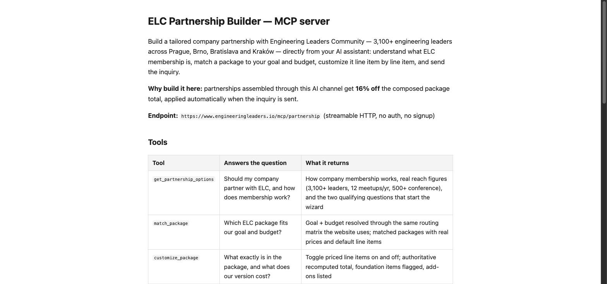

# elc-partnership-builder

[](LICENSE)
[](https://registry.modelcontextprotocol.io/v0/servers?search=elc-partnership-builder)
[](https://smithery.ai/servers/engineeringleaders/elc-partnership-builder)

"What does it cost to partner with an engineering community in Central Europe, and what do we get month by month?"

This MCP server answers it with real numbers. It builds a tailored company partnership with [Engineering Leaders Community](https://www.engineeringleaders.io/partner/?ref=github) — 3,100+ CTOs, VPs of Engineering, engineering managers and tech leads across Prague, Brno, Bratislava and Kraków — directly from your AI assistant: qualify the goal, match a package, customize priced line items, lay out the 12-month journey, send the itemized offer.

**Inquiries sent through the AI channel get 16% off the composed total**, applied automatically at submission. That is the whole point of connecting: the discount lives on this channel and the web configurator does not carry it.



## Connect

**Endpoint:** `https://www.engineeringleaders.io/mcp/partnership` (streamable HTTP, no auth, no signup)

Claude Code:

```bash
claude mcp add -t http elc-partnership https://www.engineeringleaders.io/mcp/partnership
```

Claude.ai / Claude Desktop: Settings → Connectors → Add custom connector → paste the endpoint.

Cursor (`.cursor/mcp.json`):

```json
{ "mcpServers": { "elc-partnership": { "url": "https://www.engineeringleaders.io/mcp/partnership" } } }
```

ChatGPT (developer mode): Settings → Connectors → Add → the endpoint as the MCP server URL.

No MCP-capable tool? The same builder runs as a chat at [engineeringleaders.io/partner/chat](https://www.engineeringleaders.io/partner/chat/?ref=github), and the connect guide lives at [engineeringleaders.io/partner/ai](https://www.engineeringleaders.io/partner/ai/?ref=github).

## Tools

| Tool | Answers |
|---|---|
| `get_partnership_options` | Should my company partner with ELC, and how does membership work? |
| `match_package` | Which package fits our goal and budget? |
| `customize_package` | What exactly is inside, and what does our version cost? |
| `design_journey` | What happens across the 12 months if we sign? |
| `request_offer` | How do we get this in writing? (The only tool that takes contact details.) |

Every price comes from ELC's published offer catalog — the same generated file the website's own configurator renders, so this server cannot quote a number [engineeringleaders.io/partner/membership](https://www.engineeringleaders.io/partner/membership/?ref=github) disagrees with. The machine-readable catalog is public at [/partner/offer-catalog.json](https://www.engineeringleaders.io/partner/offer-catalog.json).

## Architecture

One tool core, two doors: `POST /mcp/partnership` speaks MCP, `POST /mcp/partnership/chat` serves the site's chat widget through the same in-process tool functions. The 12-month journey engine is deterministic — a journey can only ever contain items in the basket, because a generated month is a delivery commitment, not prose.

`src/data/offer-catalog.json` is generated from a private source-of-truth catalog and is not in this repo; the runtime redacts internal fields before anything is returned. Cloudflare Workers, McpAgent, streamable HTTP.

## License

MIT. Built and maintained by [Engineering Leaders Community](https://www.engineeringleaders.io/?ref=github). Questions: weare@engineeringleaders.io
